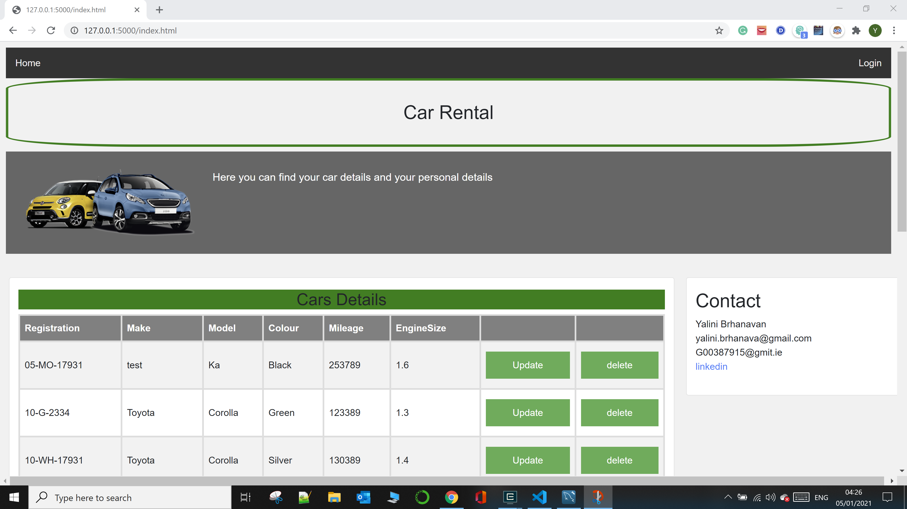
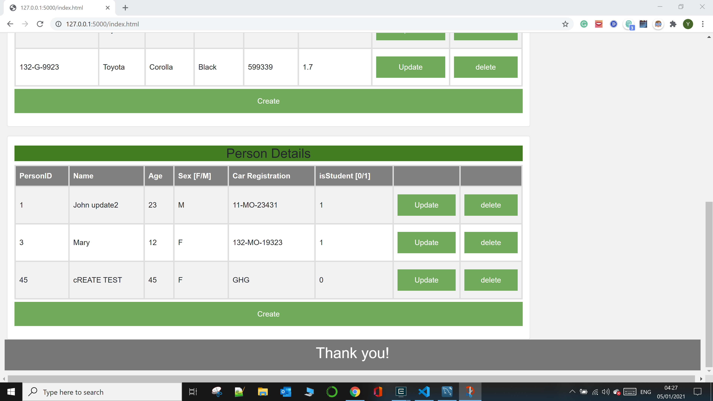
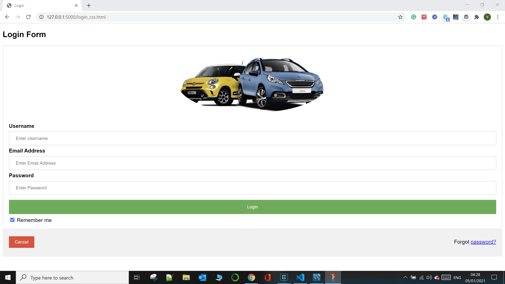

## **Yalini Brhanavan - GMIT - H.Dip Data Analytics**

* DATA REPRESENTATION AND QUERYING: Project 2020
* Sep 2020

---
## Project Outline
1. A basic Flask server that has a
2. REST API, (to perform CRUD operations)
3. One or more database table and
4. Accompanying web interface, using AJAX calls, to perform these CRUD operations.

**How to run the file:**
* Python version 3.8 was downloaded via Anaconda Navigator 3 to Windows 10 OS (https://www.anaconda.com/).
* Check FLASK APP and install it  
* I used a config.py, there is a template of this file in this git repository called 'dbconfigtemplate.py' please rename it and change the credentials. I have *config.py in gitignore. 
* I have also included sql script (initdb.sql) for the database and the table with sample data. you can use this to create the database (yalinidatarepresentation) and the tables (car and person).
* "server.py" that implement the REST API 
* Staticpages folder contains the "login_css.html" and  "index.html" .  "index.html" will use AJAX to link to the server and provide a nice user interface.
* CarDao.py and PersonDao.py 

Webpage design:
Home page with Car Table and person Table. The webpage is inter linked with the login page.
 
  
  
  

Login Page
  
  

----
**REFERENCES:**    
* class notes
* https://stackoverflow.com/ 
* https://www.w3schools.com/
